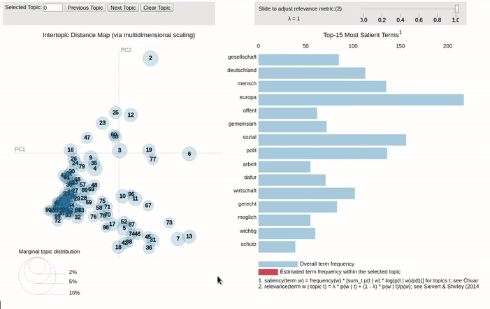

# Textmining Project - Similarity measurement of News Articles and Party Manifestos

## prerequisits
Manifestos are available as csv and spiegel articles are provided as .xml files. The preprocessing step creates out of these files corresponding .json files that are used in all followiing steps.
The Spiegel corpus xml files should be extracted to `data/spiegel/` and the manifesto csv files to `data/manifestos/` for best reproducibility.
To install all required python dependencies simple exec `pip3 install -r requirements.txt` in project root, furthermore python3 is required.

## Word Based Similarity Measurement Algorithms
The algorithms, jaccard, tf cosine similarity and tf-idf cosine have the following functionality:

- Compare manifesto of a certain party to all other manifestos
- Compare manifestos to spiegel articles.

A typical workflow involves:
    
1. Having raw manifestos and Spiegel articles in the data folder
2. Calculate the Similarity between manifestos to newspaper articles
3. Evaluate output for a specific purpose. E.g. print articles that have the highest similarity with respect to a certain manifesto. 

Sample workflows are available in folder "examples" with sample bash scripts for different algorithms. In an older version file "plot.py" was used for result visualization but the current outputs are visualized by Microsoft Excel.
The ipython notebook "EvaluationSample.ipynb" provides further samples where output is generated with respect to different metrics. For using the ipython notebook, the files provided in : https://drive.google.com/open?id=0Bx3bSdxqXIf6TWZ0YTZOdUFxMzQ have to be extracted and copied to folder "data".

## LDA



There are several scripts available to extract and explore topics as well as compare similarities with Latent Dirichlet Allocation. All scripts have configurable variables that can be altered in the corresponding python files.

- **lda_manifesto.py:** train LDA model using all manifestos in a pre-configured folder. This involves splitting each manifesto into sentences and take those sentences as the input corpus. Optionally a pyLDAvis html can be generated 
- **lda_spiegel.py:** train LDA model using all spiegel articles in pre-configured folder. The corpus of spiegel articles of a year are taken as input. Optionally a pyLDAvis html can be generated.
- **lda_print_topics.py:** print a configured amount of topics and terms per topic for a pre-calculated LDA model.
- **lda_generate_pyLDAvis_html.py:** generate a pyLDAvis html file for exploration of a LDA model (LDA model is loaded from file)
- **lda_compare_manifesto_with_manifestos.py:** Compare one manifesto with a configurable amount of other manifestos. Similarity is calculated using cosine similarity of the LDA model vectors.
- **lda_compare_parties.py:** Compare LDA models generated for each party (using all manifestos of this party as input). Similarity is calculated using cosine similarity of the LDA model vectors.

A typical workflow involves:

1. Having raw manifestos and Spiegel articles in the data folder (as described in prerequisits)
2. Train LDA model for both all manifestos and Spiegel years
3. Explore topics using **lda_print_topics.py** and more advanced with pyLDAvis
4. Compare manifestos and parties

e.g.
```
# train LDA model for manifestos
python3 lda_manifesto.py
# train LDA model for Spiegel articles (this can take, depending on e.g. the amount of topics, a lot of time)
python3 lda_spiegel.py
# generate pyLDAvis html for a specific LDA model
python3 lda_generate_pyLDAvis_html.py
# open the generated html and analyse topics 
```

